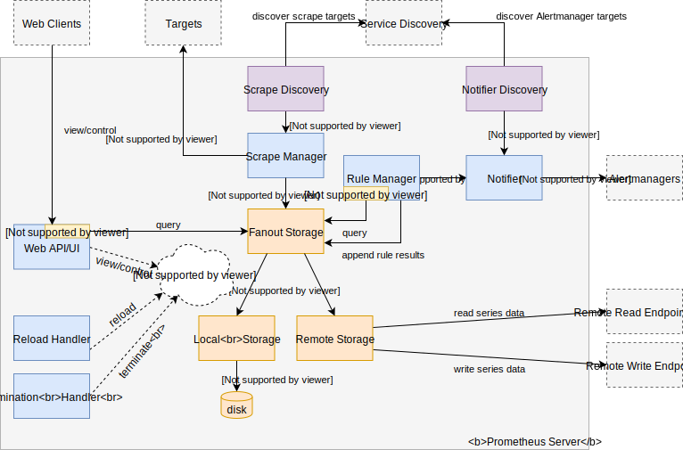

# Prometheus Internal architecture

The Prometheus server consists of many internal components that work together in concert to achieve Prometheus's overall functionality. This document provides an overview of the major components, including how they fit together and pointers to implementation details. If you are a developer who is new to Prometheus and wants to get an overview of all its pieces, start here.

The overall Prometheus server architecture is shown in this diagram:

**NOTE**: Arrows indicate request or connection initiation direction, not necessarily dataflow direction.

The sections below will explain each component in the diagram. Code links and explanations are based on Prometheus version 2.3.1. Future Prometheus versions may differ.

See

[https://github.com/prometheus/prometheus/blob/release-2.20/documentation/internal_architecture.md](https://github.com/prometheus/prometheus/blob/release-2.20/documentation/internal_architecture.md)

Prometheus stores time series samples in a local time series database (TSDB) and optionally also forwards a copy of all samples to a set of configurable remote endpoints. Similarly, Prometheus reads data from the local TSDB and optionally also from remote endpoints. Both local and remote storage subsystems are explained below.

### Fanout storage

The [fanout storage](https://github.com/prometheus/prometheus/blob/v2.3.1/storage/fanout.go#L27-L32) is a [`storage.Storage`](https://github.com/prometheus/prometheus/blob/v2.3.1/storage/interface.go#L31-L44) implementation that proxies and abstracts away the details of the underlying local and remote storage subsystems for use by other components. For reads, it merges query results from local and remote sources, while writes are duplicated to all local and remote destinations. Internally, the fanout storage differentiates between a primary (local) storage and optional secondary (remote) storages, as they have different capabilities for optimized series ingestion.

Currently rules still read and write directly from/to the fanout storage, but this will be changed soon so that rules will only read local data by default. This is to increase the reliability of alerting and recording rules, which should only need short-term data in most cases.

### Local storage

Prometheus's local on-disk time series database is a [light-weight wrapper](https://github.com/prometheus/prometheus/blob/v2.3.1/storage/tsdb/tsdb.go#L102-L106) around [`github.com/prometheus/prometheus/tsdb.DB`](https://github.com/prometheus/prometheus/blob/master/tsdb/db.go#L92-L117). The wrapper makes only minor interface adjustments for use of the TSDB in the context of the Prometheus server and implements the [`storage.Storage` interface](https://github.com/prometheus/prometheus/blob/v2.3.1/storage/interface.go#L31-L44). You can find more details about the TSDB's on-disk layout in the [local storage documentation](https://prometheus.io/docs/prometheus/latest/storage/).

### Remote storage

The remote storage is a [`remote.Storage`](https://github.com/prometheus/prometheus/blob/v2.3.1/storage/remote/storage.go#L31-L44) that implements the [`storage.Storage` interface](https://github.com/prometheus/prometheus/blob/v2.3.1/storage/interface.go#L31-L44) and is responsible for interfacing with remote read and write endpoints.

For each [`remote_write`](https://prometheus.io/docs/prometheus/latest/configuration/configuration/#%3Cremote_write%3E) section in the configuration file, the remote storage creates and runs one [`remote.QueueManager`](https://github.com/prometheus/prometheus/blob/v2.3.1/storage/remote/queue_manager.go#L141-L161), which in turn queues and sends samples to a specific remote write endpoint. Each queue manager parallelizes writes to the remote endpoint by running a dynamic number of shards based on current and past load observations. When a configuration reload is applied, all remote storage queues are shut down and new ones are created.

For each [`remote_read`](https://prometheus.io/docs/prometheus/latest/configuration/configuration/#%3Cremote_read%3E) section in the configuration file, the remote storage creates a [reader client](https://github.com/prometheus/prometheus/blob/v2.3.1/storage/remote/storage.go#L96-L118) and results from each remote source are merged.

- Get Influxdb at:

[https://portal.influxdata.com/downloads/](https://portal.influxdata.com/downloads/)

- Documentation at:

[https://docs.influxdata.com/influxdb/v1.8/introduction/get-started/](https://docs.influxdata.com/influxdb/v1.8/introduction/get-started/)